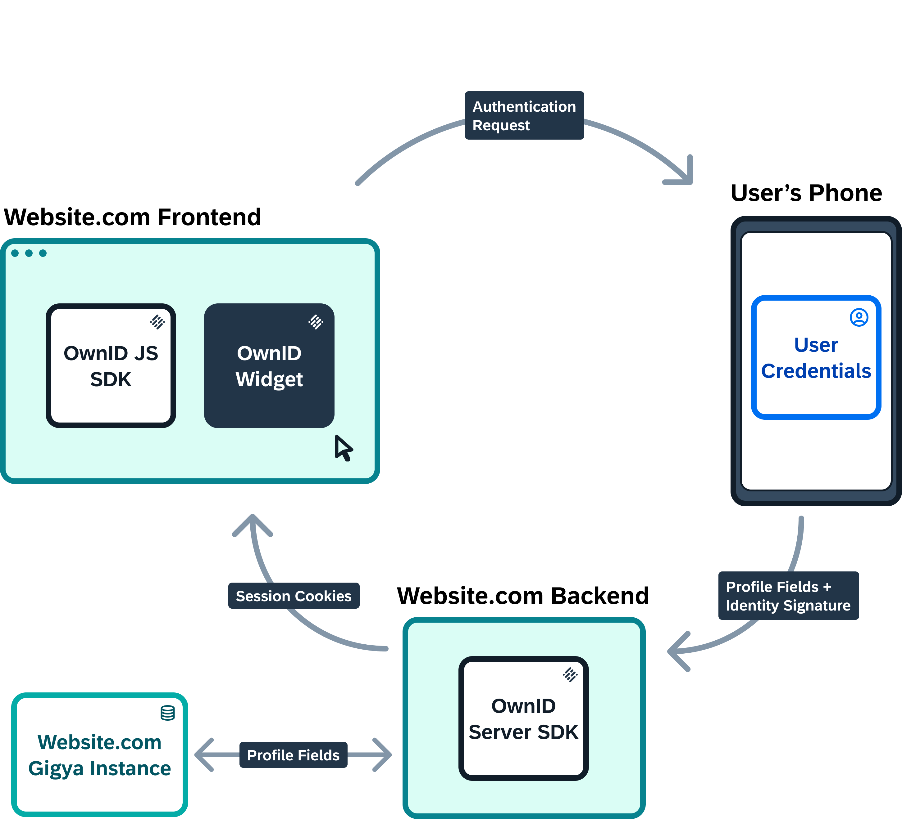

Welcome to the developer's guide and documentation portal of OwnID by SAP.

OwnID by SAP offers a password-less login to your website. It is using cryptographic keys to replace the password. The public part of the keys is then being stored in the Identity Management System while the private part is stored on the mobile device. As a result, the mobile phone becomes the user’s method of login.

When a user access your website from the mobile, all the interaction with the user is in the mobile. However, when the user access your website from the desktop, they will be presented with QR code to be scanned by their mobile device.

OwnID by SAP include the following components:
* Widget you integrate in your website
* WebApp that run on the user mobile device
* Server that communicate with the Identity Management System. The server can be created by the customer using OwnID SDK or OwnID can host a server for you

OwnID supported scenarios:
* Register
* Login
* Can't login
* Link account when user click OwnID widget in login page but did not register yet. In this scenario the user will be asked to enter password for the last time

Notice that OwnID does not store any data. The credentials are stored on the user’s mobile and the Identity Management System. 

