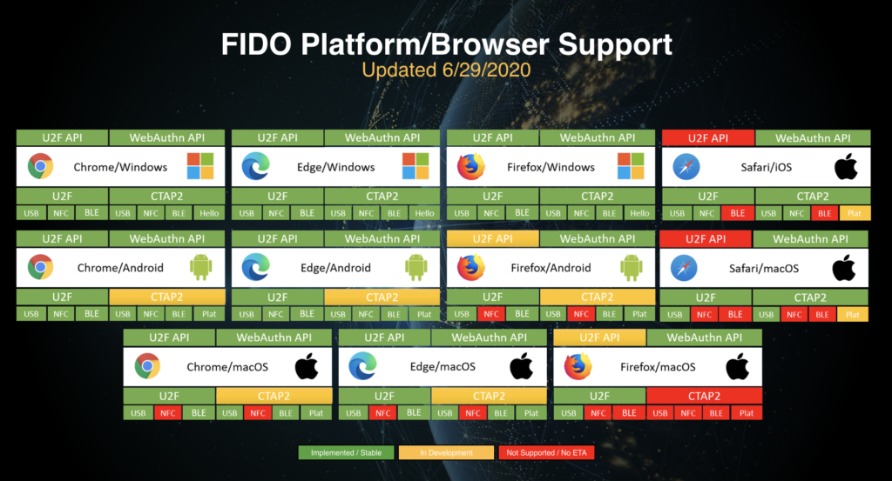

# Security

## FIDO2/WebAuthn

OwnID uses [FIDO2](https://fidoalliance.org/what-is-fido/), a specification of the non-commercial FIDO Alliance which aim to eliminate passwords on the web. When FIDO2 is deployed the user is being asked to identify with the phone's lock mechanism.

If a user's mobile device supports FIDO2 then OwnID will trigger this as the method of authentication. In this scenario OwnID will use the FIDO2 API in the JavaScript code. The public key is stored on the user's profile in the Identity Management System.

When FIDO2 is not supported, a key pair is created and stored in the mobile device's browser storage. The public part of the key is stored in the user profile in the Identity Management System (similar to the public part of FIDO2). If a user’s  mobile device lock mechanism is not activated, OwnID will make the recommendation to activate it.

### FIDO2 browser and platform support <!-- {docsify-ignore} -->

In 2019 Google delivered native platform support for Android devices. Microsoft followed suit and offered native platform support for Windows 10 and Windows Hello compatible devices. In 2020, Apple announced full native support for iOS devices.

The following picture illustrates the adoption status across each of the various platforms:

source: https://fidoalliance.org/fido2/fido2-web-authentication-webauthn/

## Data Storage

OwnID does not store any user data. The public part of the encrypted keys is stored in your Identity Management System while the private part is stored on the mobile device and cannot be exported.
